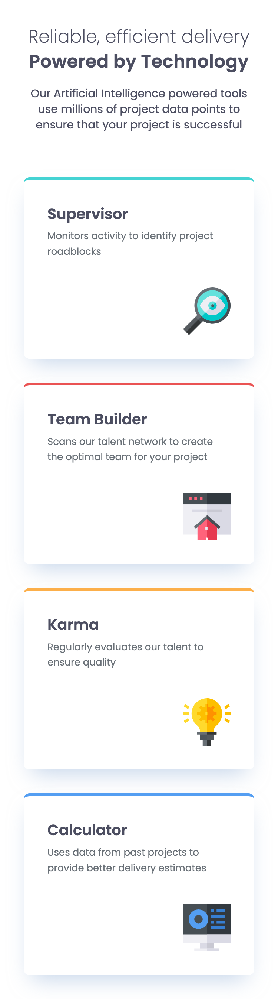
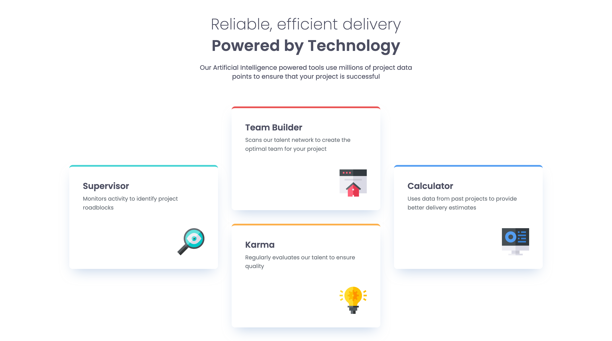

# Frontend Mentor - Four card feature section solution

This is a solution to the [Four card feature section challenge on Frontend Mentor](https://www.frontendmentor.io/challenges/four-card-feature-section-weK1eFYK).

## Table of contents

- [Overview](#overview)
  - [The challenge](#the-challenge)
  - [Screenshot](#screenshot)
  - [Links](#links)
- [My process](#my-process)
  - [Built with](#built-with)
- [Author](#author)

## Overview

### The challenge

Users should be able to:

- View the optimal layout for the site depending on their device's screen size

### Screenshot

Mobile View:

Desktop View:

### Links

- [Solution URL](https://www.frontendmentor.io/solutions/responsive-four-card-feature-section-using-css-grid-2KUAyyYSjm)
- [Live site URL](https://fem-four-card-feature-section-five.vercel.app/)

## My process

### Built with

- Semantic HTML5 markup
- CSS custom properties
- Flexbox
- CSS Grid
- Mobile-first workflow

## Author

- [Frontend Mentor Profile](https://www.frontendmentor.io/profile/dionysia-lemonaki)
- [LinkedIn](https://www.linkedin.com/in/dionysia-lemonaki-developer/)
